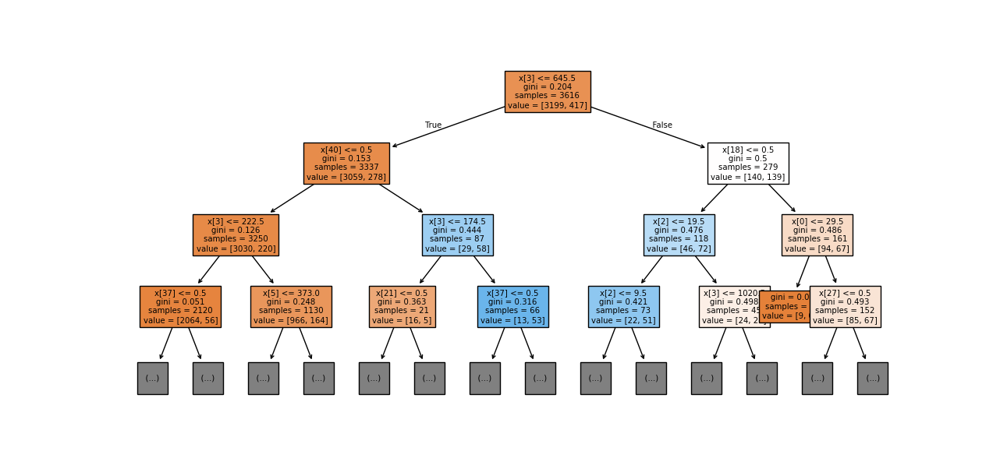

# 🌳 Decision Tree Classifier (Prodigy InfoTech Task-03)

## 📌 Project Overview
This project builds a Decision Tree Classifier to predict whether a customer will purchase a product or service based on demographic and behavioral data.

---

## 🚀 Key Features
- Data preprocessing using Pandas
- Categorical encoding using One-Hot Encoding
- Model building using DecisionTreeClassifier
- Accuracy evaluation
- Visualization of decision tree

---

## 📊 Dataset
- Bank Marketing Dataset

---

## 🛠️ Tech Stack
- Python
- Pandas
- Matplotlib
- Scikit-learn

---

## ⚙️ Installation & Run

```bash
pip install pandas matplotlib scikit-learn
python task3.py
```

---

## 📈 Output

### Decision Tree Visualization


---

## 🎯 Result
- Model trained successfully
- Accuracy printed in terminal
- Decision tree visualization generated

---

## 💡 Conclusion
Decision Tree helps in understanding decision-making logic clearly and is useful for classification problems.
